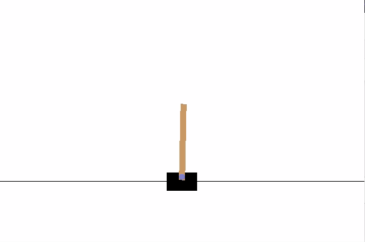
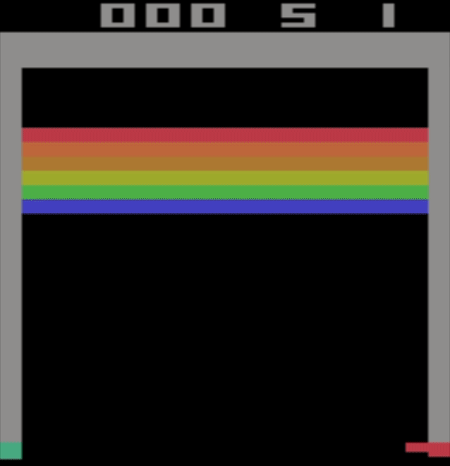
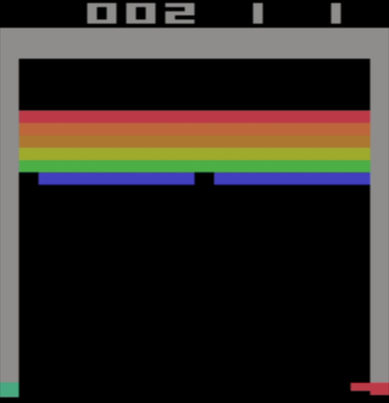
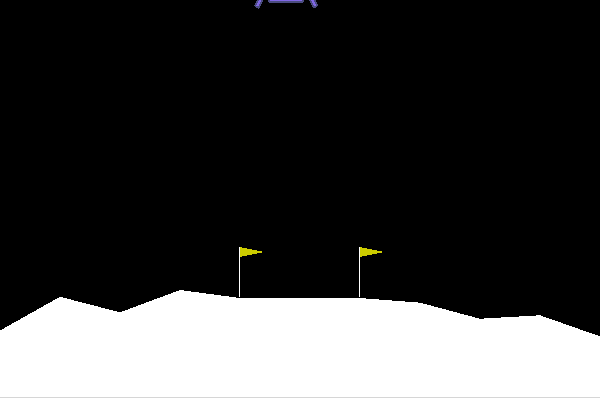
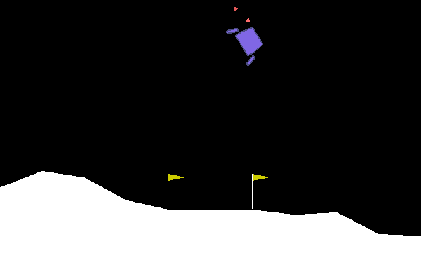

# COGS 298: Deep Learning
#### An Exploration of Policy Based Reinforcement Learning and Frustration
###### By Griffin Berlstein and Ian Leinbach

### Problem Motivation
Deep learning has seen success in many supervised learning domains, which has
naturally spurred investigation of other potential applications.  Reinforcement
learning (RL) has been of particular interest because it represents a common
class of problems, yet ones that are decidedly unsolved.

RL is also immediately interesting because it frequently means competition with
machines in our own domain: games. Put simply, reinforcement learning presents
an agent with an environment in which it must take actions that have some (often
unclear) relation to an eventual reward. The agent must learn what actions to
take in order to effectively navigate the environment and maximize reward.

This differs from supervised learning because while the objective is clear, the
path isn't. We often don't know the best strategy, so can't train a network to
reproduce it. Though if some simple strategies exist, they could be used as a
base point. In general, though, we can tell when a network is succeeding in a
task but not how to get it to succeed. Framed this way, the task is a search
through the action/policy space in order to find a maximally effective policy.

RL is frequently applied to games (chess, go, Atari, etc.) not because it's the
only application of these techniques — if anything this is perhaps the most
mundane way it could be used — but rather because these are all spaces that can
be effectively simulated. This allows for environments to be standardized,
explored, and (most importantly) shared. RL agents are going to make mistakes,
and it's perfectly acceptable if these mistakes occur in a simulation, but
they're far more problematic when they occur in the real world, as with an
autonomous vehicle.

With that in mind, OpenAi created a python library called Gym that allows for
easy access to many of these simulated environments with the goal of acting as a
training ground for RL techniques.

*Mnih, V., et al (2015). Human-level control through deep reinforcement
learning. Nature, 518(7540), 529.* showed that it was possible to attain
human-level or better performance in many Atari games through Deep Q-Networks.
The results of this paper were very exciting, not only because of the success
seen, but also the domain of the input. The agent was given only visual
information and the game score — the exact things that a human player would have
access to.

These results are from 2015 and relied on a value-based approach.  Since then,
there has been plenty of work with policy-based approaches, so naturally we
wanted to try them.

###### Our Goal:
**Attempt to replicate these results using policy methods**

---
### A Brief Survey of Reinforcment Learning
#### Q-Network and Value-based versus Policy-based methods

At the moment, there are two broad categories of approaches to RL problems:
value-based and policy-based. Value-based approaches predict expected reward
based on actions and states. They can be used to model which of the many paths
is expected to generate the most reward.

Note, however, that value-based methods are really an attempt to model the
reward function of the environment and actually say nothing about what the agent
should *do*. Given a perfect reward function, the optimal policy could be
derived to maximize the total reward obtained; however, given that the reward
function is seldom going to be perfect, we can't be sure that any policy derived
from it is optimal.

Given a reward function, there is one natural policy that can be derived, a
step-wise greedy policy: take the action at each step that offers the greatest
reward. It's easy to see how this policy could go wrong, as the best choice at
any given step is not necessarily the best across an entire episode in the
environment.

To that end, one could implement an epsilon-greedy strategy, which defers to a
random action some amount of the time. This can be good for exploration but
feels somewhat unsound given the information derived from the model.

Deep Q-Networks attempt to solve the problem of shortsighted, greedy actions and
can be made deterministic or semi-stochastic as one sees fit. In essence, a
Q-Network propagates rewards backward in time to try to associate actions that
have low immediate rewards with later states that produce high reward to give
the agent some "foresight".

In practice, as demonstrated with the Atari environments, this can be quite
effective as long as the agent is encouraged to explore the environment to gain
enough intuition about the reward space.

Note, however, that this once more does not dictate a policy. The natural policy
to take from a Q-Network would be some form of epsilon-greedy or perhaps a
deterministic greedy policy, and provided robust reward and state information
this could be quite successful; however, it is not necessarily perfect.

Because the network is learning the reward function rather than policy, there
can be issues with state aliasing. State aliasing is when two or more states
effectively appear the same to the network, possibly due to limitations with the
observation space while representing distinct environmental states. With a
deterministic policy, it is possible for an agent to get stuck in a loop due to
aliased states or simply make undesirable decisions. This can in part be solved
by semi-stochastic derived policies; however, given the various considerations
needed to derive a useful policy, one might consider whether or not it would be
better to have the network learn a policy rather than the reward function.

This is the philosophy behind policy-based methods. Rather than learn the reward
and derive a policy from it, policy-based methods iterate on the policy itself
based on the reward signal from the environment.

It is this approach that we wanted to take with these environments.

#### Simple Policy Gradient Approach
Unlike our value-based networks, a policy-based approach will be inherently
stochastic, which automatically sidesteps the issue of state aliasing. It also
means that rather than output a single real value for a given state, our network
will instead produce a probability distribution across the action space. To
determine what action to take, this distribution can be sampled.

This has a nice human interpretation of certainty. For states with highly
unbalanced probability distributions, we can say that the network is highly
confident of the action that should be taken in that state, while for more
uniform distributions, the network can be said to be uncertain or indifferent to
the action chosen.  While that is a personified reading of the network behavior,
it represents the intuition behind the functionality well. The shape of the
network probability distribution turns out to be fairly important. While it
might sound desirable to have a highly confident network, this is not always the
case. We will return to this later when discussing network entropy; however, to
gain an intuition for why this might be the case, remember than in the real
world, confidence does not necessarily mean correctness and high certainty
naturally inhibits exploration.

But with this intuition under our belt, we can discuss the actual work of
training a policy agent. The policy agent performs a sequence of rollouts, where
it plays the game and records the state, action taken, and reward at each step.
At the end of each episode the agent can look at the final reward and propagate
it backward in time, with some decay, to associate the earlier action with the
end result. This modified reward is called *Advantage* and serves as a signal to
guide the adjustment of the policy.

With all the data obtained from a rollout, the network can modify the policy
based on the results. Since the advantage represents some reward quantity at
each time step, the network can encourage or discourage each action it took
based on the advantage and since the network outputs probabilities this will
naturally shift the likelihood of other actions. This makes the network updates
smoother, as updating the policy slowly causes an update of the output
distribution.

The actual act of training at each step takes the state the network was in, the
action it took (sampled from the output distribution at that step), and the
advantage. From these the network will encourage the action taken based on some
modulation by the advantage. In English this means that the network will
encourage the action based on the magnitude and direction of the advantage. A
strong negative advantage — indicating an action in part responsible for an
undesirable state — will be discouraged and an action associated with a strong
positive advantage will be encouraged. This means that, due to temporal
propagation, all actions near the end of an episode — where presumably a
negative action was encountered — will be discouraged while those near the
beginning will likely be encouraged as the negative propagation will decay
overtime.

This is approach changes the policy overtime to reflect the rewards obtained
from the environment. In some sense this approach can be relatively naive as it
will discourage states that are temporally proximate to undesirable states
without regard for the action that caused the punishment in the first place. It
may be possible that every action leading up to a failure was a good choice with
the exception of the final action, yet they will all be discouraged.

#### A Hybrid Approach
Another approach that builds on both policy and value methods can be used to try
to address the problems of each by combining their strengths. The simplest of
these method is called Actor-Critic and consists of two networks, a policy
network and value network, working in tandem.

The Critic (value) network works as before by learning the reward function
through environment exploration. This can be the explicit reward function at
each step, though it is far more common to use the time discounted advantage, or
a piecemeal combination of the two that computes estimates in pairs with a light
temporal discount.

The Agent (policy) network is the same as before in the policy gradient
approach, the only difference is what advantage it uses.

Instead of using the time discounted rewards across the batch as the advantage
for the policy network, we instead use the critic error (often called TD error).
This might seem a little strange at first.

Remember that the Critic, on some level, can be seen as a model of the
environment, albeit, on that is solely concerned with expected reward.  While
the policy is a model of the environment concerned with probability
distributions based on the input observation. Since, both learn from the same
rollout data, they are both models of the same space.

When we encounter an error in the critic, it means our model of the environment
is off and that we should modify the policy based on the error. Suppose that the
critic has a positive error. This means that the critic underestimated the value
of a given state. Under these circumstances we would want the agent to make the
associated action more probable. Similarly, when the critic overestimates the
value of a state — producing a negative advantage — we would want to reduce the
probability of the taken action since it may be erroneously high.

This is also subtly different from the policy gradient approach with regard to
negative states. A policy gradient will always naively avoid negative states. An
actor-critic approach may actually encourage actions from negative states.
Consider a state that gives some negative reward where the critic has vastly
overestimated the magnitude of the negative reward. This will result in a
positive error meaning the action taken to this negative state would actually be
encouraged.

At first brush this might seem quite strange, why would we encourage an action
that resulted in negative reward? In this instance since the critic vastly
overestimated the "danger" of the state, we would expect that the policy
assigned it a much lower probability than warranted. In effect, the network was
overreacting to a state that, while still negative, might not need to be avoided
to the extent originally thought. Suppose there is some moderate positive reward
state that exists beyond the negative state. A simple policy gradient approach
would have the network avoid the negative state altogether, while the actor
critic, due to the overestimate, would actually make entering the state slightly
more likely. This give the actor-critic network a chance to discover the
positive state that would be ignored by the policy gradient.

This is the value of the actor-critic approach, because there are two models of
the environment, errors in our expectation can be used to adjust our policy to
more meaningfully match what the environmental feedback.

#### A problem of exploration
By now you might have realized an issue with all the described approaches, and
it is one that is a core problem of RL. The entire problem is a search, where
accessible states are determined by the current state, which makes navigating
the search space particularly challenging. In order for a network, either value-
or policy-based, to learn of a new better path, it must first stumble onto the
path. This means that while there may be a far better policy available, the
network may never encounter it because it is too far away to be inaccessible.

It may help to visualize the network as wandering a hilly environment in the
fog, searching for the highest place. It can't make big jumps and only makes
decisions based on what it sees around it. So far this sounds very similar to
standard supervised learning; however, the difference is the metaphorical fog.
An RL agent learns based on where it is because it gets data from the present
policy. If the RL agent falls into a bad policy, then it in turn gets bad data
and can get stuck. It's like walking up a small hill in the fog. With knowledge
being dependent on the hill, and constrained by the fog, it seems to the agent
that everywhere around it is worse, when in reality there may be a far greater
peak just out of view.

This is why it is easy for RL agents to get stuck in local optima.  They are
almost myopic when it comes to understanding their place in the larger scope of
the environment. This is also why encouraging exploration is incredibly
important.

A network that is overly certain, that is, producing a heavily lopsided
distribution will fail to explore the environment and will cease to meaningfully
iterate on the policy as some actions may have their probability reduced to near
zero. To combat this encouraging moderate entropy in networks may be desirable
as premature pruning of the action space will result an agent that performs
poorly.

---
### Our Experiments and Results

#### Attempt 1 - Cartpole
We started with the 'canonical' toy environment, Cartpole. This environment
features a laughably small action and observation space with a relatively simple
goal, balance a pole on the cart without it falling over for an extended period
of time.

This didn't actually even require any machine learning, as we can create a
simple single layer network and randomly initialize the weight matrix until a
solution was found. Given that the weight matrix contained only 4 elements, this
was easily done and a solution could be found within seconds, often taking fewer
than 2000 initializations to obtain a perfect score.

We also tested the basic policy gradient approach on the environment which did
find a solution, though overall seemed to be less successful than the randomly
initialized agent. This was an early hint at some fo the difficult associated
with searching the solution space.

#### Attempt 2 - Breakout
From there we moved to work on the breakout environment using a policy gradient
approach. This occasionally seemed to bear fruit; however, more often than not
the agent would converge to taking no actions whatsoever and would typically hug
the corners of the screen.

###### Trained Agent

We experimented with adding additional punishments to try to encourage it to
stay in the center, but this usually resulted in an aggressively jittery agent
that also still hugged the corners of the screen.

In general the agent often performed worse than simply moving at random, though
adding additional punishments resulted in slightly different behavior. However,
invariably, the agent fell into a local optima that resulted in not playing the
game. Since the agent is punished when it misses the ball — which occurs far
more frequently than breaking a brick — the policy agent naturally avoids
circumstances where it is possible to miss the ball. In this case, the path of
least resistance, that is the nearest policy, is one that simply doesn't
interact with the ball at all and causes it never to be fired. This is a local
optima because it won't lose any points for missing the ball. Adding extra
punishments and early termination only confuses the network. It is too much of a
jump from the early semi-random movements to reliably hitting the ball, so even
if the agent also wants to avoid early termination caused by not playing the
game, it still cannot find the path to a state that allows for actual play and
will oscillate between sitting in the corner and moving around haphazardly, all
without firing the ball.

###### Untrained Agent

In theory it may be possible to design enough punishments to cause the agent to
play the game properly, though their magnitude and quantity would require
intense amounts of trial and error. Even if we did this successfully, it would
still be antithetical to the ultimate goal of RL, that the agent learn the best
policy from interaction with the environment. Learning with stringent
punishments defeats the purpose because it requires us to restrict all possible
paths until the agent is forced to choose the correct one (a la Asimov's
Foundation) which is not feasible in any complicated environment.

Given the tendency of the policy gradients to get trapped in a local optima, we
decided to test actor-critic methods on a simpler environment

#### Attempt 3 - Lunar Lander with Actor Critic
We implemented a simple version of the actor-critic network for the lunar lander
environment and focused our efforts on designing a robust handler and
architecture such that we would easily be able to switch environments if needed.

In the process of doing this we discovered a series of different ways to
approach training, for one the critic network could be made to train
continuously by making estimates at each time step about what it believed the
total reward of the entire episode to be, which produced dynamic behavior in
real time. This was encouraging as the lander would rapidly seem to develop a
good baseline policy, however, it would never converge to something successful.

We also implemented a batch based training method that tasked the critic with
learning the discounted temporal rewards across a batch similar to how the
original policy gradient worked. The continuous critic behavior could also be
done in a batch setting, but generally did not produce interesting results.

In experimenting with the batch training on temporally discounted rewards we
again encountered the problem of local optima causing searching to stop. The
agent would frequently choose to just fire a single thruster and crash into the
ground as the probability of all other actions was reduced to near zero.

This is where adding entropy encouragement became important.  This changed the
network behavior significantly and often enabled it to escape or avoid these
sorts of local optima; however, the agent, while often close to desired
behavior, would occasionally exhibit extreme volatility and generally failed to
learn that it needed to stop firing the thrusters upon landing.

There are more approaches we could try to improve the agent's behavior but due
to limited time only a few could be attempted.  Often, despite changes to the
architecture, the agent would fall into a stable, but ultimately incorrect
pattern of falling or haphazard rocket fire. Across our batched rollouts we
never observed a positive average reward, suggesting that the occasional
positive episode was the result of luck or a chance alignment rather than a
successful policy.

Though our original goal was to apply these methods to the atari library, the
fact that the actor critic model failed to solve the lunar lander environment
gave us pause. It seemed better to hone the approach in a simpler environment
first, before returning to the more complex breakout environment.

The results, while disappointing are an excellent demonstration of the various
challenges associated with RL. In general, it's hard to know what to do, even
when using a common approach. There are many hyperparameters that affect the way
the agent searches the policy space with little indication of how they should be
set. If entropy is encouraged too much the agent is effectively random, but if
it is not encouraged enough the agent falls into local minima. If finding the
goldilocks zone for entropy isn't challenging enough, then there are a myriad of
ways that the network could be structured and the loss computed, all of which
ultimately change the search functionality.

With limited resources and little direction we were effectively doing a random
search of possible designs, so it is unsurprising that we were unable to obtain
an optimal agent; however, given some of the emergent behavior, there is no
reason to believe that the task is impossible — just challenging.

---

### Running the Code
#### Requirements (see Requirements.txt)
Python 3.5
   * Tensorflow
   * OpenAI Gym
       * Box2D Environments
       * Atari Environments
   * Numpy
   * Jupyter Notebook

#### Using the Notebooks
Each of the notebooks corresponds to a single environment and the experiment
with which we had the most success. The notebooks are designed to be run
sequentially for setup, then the training functions may be executed and tweaked
as desired. Results can be printed out with verbosity flags. And the environment
may also be rendered during training, though this will frequently cause the
environment to behave slowly.

The handler class in the notebooks can handle saving and loading the model so
that trained versions may be retrieved. There is documentation regarding their
use within the notebooks themselves.

In general, the notebooks are heavily commented to make their use more intuitive
and clear.
